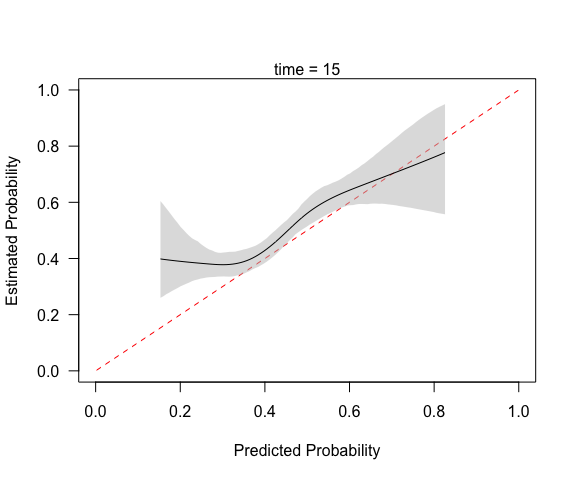

<!-- README.md is generated from README.Rmd. Please edit that file -->

# pmcalibration: Calibration Curves for Clinical Prediction Models

A clinical prediction model should produce well *calibrated* risk
predictions, meaning the predicted probabilities should align with
observed outcome rates. There are different levels at which calibration
can be assessed (see <https://pubmed.ncbi.nlm.nih.gov/26772608/>); this
package focuses on assessing “moderate” calibration via non-linear
calibration curves. `pmcalibration` implements calibration curves for
binary and (right censored) time-to-event outcomes and calculates
metrics used to assess the correspondence between predicted and observed
outcome probabilities (the ‘integrated calibration index’ or $ICI$, aka
$E_{avg}$, as well as $E_{50}$, $E_{90}$, and $E_{max}$ - see below).

A goal of `pmcalibration` is to implement a range of methods for
estimating a smooth relationship between predicted and observed
probabilities and to provide confidence intervals for calibration
metrics (via bootstrapping or simulation based inference). Users are
able to transform predicted risks before creating calibration curve (for
example, logit transforming appears to improve performance when using a
regression spline - <https://doi.org/10.31219/osf.io/4n86q>).

The examples below demonstrate usage of the package.

# Binary outcome

    # to install
    install.packages("pmcalibration") # cran
    # or 
    devtools::install_github("stephenrho/pmcalibration") # development

``` r
library(pmcalibration)

# simulate some data for vignette
set.seed(2345)
dat <- sim_dat(1000, a1 = -1, a3 = 1)

# show the first 3 columns (col 4 is the true linear predictor/LP)
head(dat[-4])
#>            x1         x2 y
#> 1 -1.19142464 -0.9245914 0
#> 2  0.54930055 -1.0019698 0
#> 3 -0.06240514  1.5438665 1
#> 4  0.26544150  0.1632147 1
#> 5 -0.23459751 -1.2009388 0
#> 6 -0.99727160 -1.1899600 0
```

We have data with a binary outcome, `y`, and two ‘predictor’ variables,
`x1` and `x2`. Suppose we have an existing model for predicting `y` from
`x1` and `x2` that is as follows

    p(y = 1) = plogis( -1 + 1*x1 + 1*x2 )

To externally validate this model on this new data we need to calculate
the predicted probabilities. We’ll also extract the observed outcomes.

``` r
p <- plogis(with(dat, -1 + x1 + x2))
y <- dat$y
```

First we can check weak calibration:

``` r
(lcal <- logistic_cal(y = y, p = p))
#> Logistic calibration intercept and slope:
#> 
#>                       Estimate Std. Error z value Pr(>|z|) lower upper
#> Calibration Intercept    -0.11      0.080   -1.38     0.17 -0.27 0.046
#> Calibration Slope         1.06      0.078    0.80     0.42  0.91 1.220
#> 
#> z-value for calibration slope is relative to slope = 1.
#> lower and upper are the bounds of 95% profile confidence intervals.
#> 
#> Likelihood ratio tests (a = intercept, b = slope):
#> 
#>                                              statistic df Pr(>Chi)
#> Weak calibration - H0: a = 0, b = 1               2.57  2     0.28
#> Calibration in the large - H0: a = 0 | b = 1      1.91  1     0.17
#> Calibration slope - H0: b = 1 | a                 0.65  1     0.42
```

The top part of the printed summary gives estimates of the calibration
intercept and slope and their 95% CIs. The bottom part of the printed
summary gives likelihood ratio tests (see [Miller et
al. 1993](https://journals.sagepub.com/doi/abs/10.1177/0272989X9301300107))
assessing (1) weak calibration as a whole (the null hypothesis of
intercept = 0 and slope = 1), (2) calibration in the large (H0:
intercept = 0 given slope = 1), and (3) the calibration slope (H0: slope
= 1). This output suggests the model the model is reasonably weakly
calibrated: the calibration intercept and slope don’t clearly differ
from 0 and 1, respectively.

We can use a calibration curve to assess ‘moderate’ calibration. Below
we use `pmcalibration` to fit a flexible calibration curve, allowing for
a non-linear relationship between predicted and actual probabilities.

In the example below, we fit a calibration curve using a restricted
cubic spline with 5 knots (see `?rms::rcs`). `transf="logit"` signals
that the predicted risks should be logit transformed before fitting the
calibration curve (this is the default for a binary `y`).
`pmcalibration` calculates various metrics from the absolute difference
between the predicted probability and the actual probability (as
estimated by the calibration curve). In this case 95% confidence
intervals for these metrics are calculated via simulation based
inference (`ci = "sim"`) with 1000 replicates. Alternatively we could
have chosen bootstrap confidence intervals (`ci = "boot"`).

``` r
(cc <- pmcalibration(y = y, p = p, 
                     smooth = "rcs", nk = 5,
                     transf="logit",
                     ci = "sim", 
                     n=1000))
```


    #> Calibration metrics based on a calibration curve estimated for a binary outcome via a restricted cubic spline (see ?rms::rcs) using logit transformed predicted probabilities.
    #> 
    #>      Estimate lower upper
    #> Eavg    0.054 0.035 0.076
    #> E50     0.059 0.031 0.079
    #> E90     0.083 0.060 0.134
    #> Emax    0.138 0.081 0.448
    #> ECI     0.368 0.177 0.751
    #> 
    #> 95% confidence intervals calculated via simulation based inference with 1000 replicates.

The printed metrics can be interpreted as follows:

- `Eavg` suggests that the average difference between prediction and
  actual probability of the outcome is 0.054 (or 5%) with a 95% CI of
  \[0.035, 0.076\].
- `E50` is the median difference between prediction and observed
  probability (inferred from calibration curve). 50% of differences are
  0.059 or smaller.
- `E90` is the 90th percentile difference. 90% of differences are 0.083
  or smaller.
- `Emax` is the largest observed difference between predicted and
  observed probability. The model can be off by up to 0.14, with a broad
  confidence interval.
- `ECI` is the average squared difference between predicted and observed
  probabilities (multiplied by 100). See [Van Hoorde et
  al. (2015)](https://pubmed.ncbi.nlm.nih.gov/25579635/).

`pmcalibration` produces a plot by default, as shown above. A more
custom plot can be obtained via `plot`.

``` r
plot(cc, xlab="Predicted Risk of Outcome", ylab="Expected Proportion with Outcome", fillcol = "blue", ideallty = 0)
```


Or one could use `get_curve` to extract data for plotting with method of
your choice.

``` r
pcc <- get_curve(cc)
head(pcc) 
#>             p        p_c      lower     upper
#> 1 0.005804309 0.14402182 0.03580601 0.4538340
#> 2 0.015274021 0.11541021 0.04965833 0.2590454
#> 3 0.024743733 0.10296340 0.05610697 0.1868902
#> 4 0.034213445 0.09521032 0.05846271 0.1543373
#> 5 0.043683157 0.08985188 0.05926845 0.1357910
#> 6 0.053152869 0.08642764 0.05780335 0.1307891
# p = predicted risk (x-axis; this is not p provided to pmcalibration but is determined by eval)
# p_c = risk implied by calibration curve (y-axis)
```

The model in its current form very slightly overestimates risk at low
levels of predicted risk and then underestimates risk at predicted
probabilities of over around 0.6.

The results above can be compared with `rms::val.prob`. Note that this
uses `lowess(p, y, iter=0)` to fit a calibration curve. In this case
`lowess` results in the curve extending beyond the possible range of
risks, but the Emax, E90, and Eavg point estimates are consistent with
those above.

``` r
library(rms)
#> Loading required package: Hmisc
#> 
#> Attaching package: 'Hmisc'
#> The following objects are masked from 'package:base':
#> 
#>     format.pval, units
val.prob(p = p, y = y) |> 
  round(3)
```


    #>       Dxy   C (ROC)        R2         D  D:Chi-sq       D:p         U  U:Chi-sq 
    #>     0.627     0.813     0.348     0.280   281.217     0.000     0.001     2.566 
    #>       U:p         Q     Brier Intercept     Slope      Emax       E90      Eavg 
    #>     0.277     0.280     0.148    -0.076     1.062     0.145     0.073     0.044 
    #>       S:z       S:p 
    #>    -2.238     0.025

Note also that the calibration intercept reported by `rms::val.prob`
comes from the same logistic regression as that used to estimate the
calibration slope. In `logistic_cal` the calibration intercept is
estimated via a `glm` with logit transformed predicted probabilities
included as an offset term (i.e., with slope fixed to 1 - see, e.g.,
[Van Calster et al., 2016](https://pubmed.ncbi.nlm.nih.gov/26772608/)).
The calibration slope is estimated via a separate `glm`. We can confirm
this by accessing the corresponding estimates from the `logistic_cal`
object.

``` r
# access the model used to get calibration slope
# and compare to estimates from val.prob
coef(lcal$calibration_slope) |> 
  round(3)
#> (Intercept)          LP 
#>      -0.076       1.062
```

  
  

# Time to event outcome

The code below produces a calibration curve, and associated metrics, for
a time-to-event outcome. The curve has to be constructed for predictions
at a given time point, so an extra argument `time` should be specified.
Here we use a restricted cubic spline with 5 knots to assess predictions
at time = 15. In this case we use `ci="boot"` to get bootstrap
confidence intervals for the metrics and curve (`ci="sim"` is currently
unsupported for time-to-event outcomes). By default predicted risks are
transformed via the complementary log-log transformation
(`function(x) log(-log(1 - x))`) before estimating the calibration
curve.

``` r
library(simsurv)
library(survival)

# simulate some data
n <- 2000
X <- data.frame(id = seq(n), x1 = rnorm(n), x2 = rnorm(n))
X$x3 <- X$x1*X$x2 # interaction

b <- c("x1" = -.2, "x2" = -.2, "x3" = .1)

d <- simsurv(dist = "weibull", lambdas = .01, gammas = 1.5, x = X, betas = b, seed = 246)

mean(d$eventtime)
#> [1] 19.60637
median(d$eventtime)
#> [1] 16.52855
mean(d$status) # no censoring
#> [1] 1

d <- cbind(d, X[,-1])

head(d)
#>   id eventtime status         x1         x2          x3
#> 1  1 12.749281      1  0.7534077  0.8486379  0.63937033
#> 2  2 24.840161      1  0.4614734 -2.1876625 -1.00954805
#> 3  3  9.087482      1 -0.6338945 -1.8948297  1.20112211
#> 4  4 24.811402      1 -1.0248165  0.6541197 -0.67035271
#> 5  5 19.072266      1 -0.1673414 -0.4625003  0.07739544
#> 6  6 13.595427      1  0.2376988  0.6452848  0.15338343

# split into development and validation
ddev <- d[1:1000, ]
dval <- d[1001:2000, ]

# fit a cox model
cph <- coxph(Surv(eventtime, status) ~ x1 + x2, data = ddev)

# predicted probability of event at time = 15
p = 1 - exp(-predict(cph, type="expected", newdata = data.frame(eventtime=15, status=1, x1=dval$x1, x2=dval$x2)))

y <- with(dval, Surv(eventtime, status))

# calibration curve at time = 15
(cc <- pmcalibration(y = y, p = p, smooth = "rcs", nk = 5, 
                     ci = "boot", time = 15))
#> Calibration metrics based on a calibration curve estimated for a time-to-event outcome (time = 15) via a restricted cubic spline (see ?rms::rcs) using complementary log-log transformed predicted probabilities.
#> 
#>      Estimate lower upper
#> Eavg    0.051 0.028 0.080
#> E50     0.046 0.020 0.077
#> E90     0.077 0.052 0.126
#> Emax    0.245 0.115 0.407
#> ECI     0.349 0.146 0.813
#> 
#> 95% confidence intervals calculated via bootstrap resampling with 1000 replicates.
mtext("time = 15")
```



Compare to `rms::val.surv`, which with the arguments specified below
uses `polspline::hare` to fit a calibration curve. Note `val.surv` uses
probability of surviving until time = u *not* probability of event
occurring by time = u.

``` r

(vs <- val.surv(S = y, est.surv = 1-p, u=15, 
                fun = function(x) log(-log(x))))
#> 
#> Validation of Predicted Survival at Time= 15     n= 1000 , events= 1000 
#> 
#> hare fit:
#> 
#> dim A/D   loglik       AIC        penalty 
#>                                 min    max 
#>   1 Add  -3949.05   7905.02  148.71     Inf
#>   2 Add  -3874.70   7763.22   60.48  148.71
#>   3 Add  -3844.46   7709.64   32.04   60.48
#>   4 Del  -3828.44   7684.51    7.10   32.04
#>   5 Add  -3824.89   7684.32    0.00    7.10
#> 
#> the present optimal number of dimensions is 5.
#> penalty(AIC) was 6.91, the default (BIC), would have been 6.91.
#> 
#>   dim1           dim2           beta        SE         Wald
#> Constant                            -2.6       0.25  -10.69
#> Time        26                    -0.031      0.005   -6.27
#> Co-1  linear                       0.063       0.26    0.24
#> Time       7.2                     -0.15      0.028   -5.42
#> Co-1     -0.81                      0.92       0.34    2.74
#> 
#> Function used to transform predictions:
#> function (x)  log(-log(x))
#> 
#> Mean absolute error in predicted probabilities: 0.0352 
#> 0.9 Quantile of absolute errors               : 0.0760
plot(vs, lim=0:1)
```


We can make a plot that is easier to compare.

``` r
x <- get_curve(cc)

with(x, plot(1-p, 1-p_c, type="l", xlim=0:1, ylim=0:1, 
             xlab="Predicted Probability of Surviving 15", 
             ylab="Actual Probability of Surviving 15"))
matplot(1-x$p, y = 1-x[, 3:4], type = "l", lty=2, 
        col="black", add = TRUE)
abline(0,1, col="red", lty=2)
```


# Internal validation

`pmcalibration` can be used to assess apparent calibration in a
development sample or to externally validate an existing prediction
model. For conducting internal validation (via bootstrap optimism or
cross-validation) users are encouraged to look at
<https://stephenrho.github.io/pminternal/>.

  
  
  
