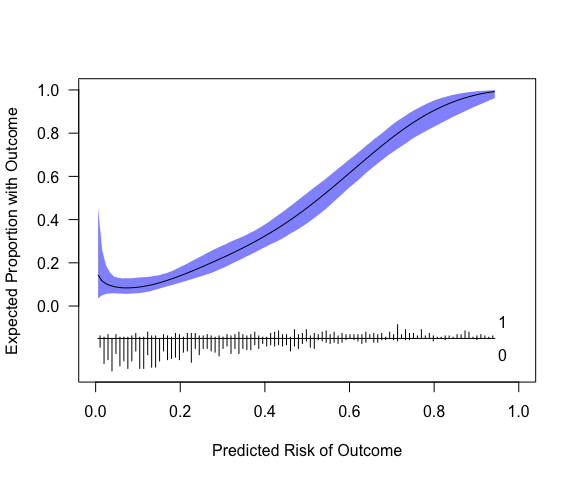
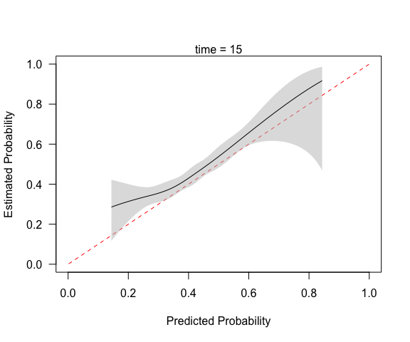

<!-- README.md is generated from README.Rmd. Please edit that file -->

# pmcalibration: Calibration Curves for Clinical Prediction Models

A clinical prediction model should produce *calibrated* risk
predictions, which means the predicted probabilities should align with
observed probabilities. There are various ways of assessing calibration
(see <https://pubmed.ncbi.nlm.nih.gov/26772608/>). `pmcalibration`
implements calibration curves for binary and (right censored)
time-to-event outcomes and calculates metrics used to assess the
correspondence between predicted and observed outcome probabilities (the
‘integrated calibration index’ or $ICI$, aka $E_{avg}$, as well as
$E_{50}$, $E_{90}$, and $E_{max}$).

A goal of `pmcalibration` is to implement a range of methods for
estimating a smooth relationship between predicted and observed
probabilities and to provide confidence intervals for calibration
metrics (via bootstrapping or simulation based inference). Users are
able to transform predicted risks before creating calibration curve
(when using a spline logit transforming appears to improve performance -
<https://doi.org/10.31219/osf.io/4n86q>).

The examples below demonstrate usage of the package.

# Binary outcome

    # to install
    install.packages("pmcalibration") # cran
    devtools::install_github("stephenrho/pmcalibration") # development

``` r
library(pmcalibration)

# simulate some data for vignette
set.seed(2345)
dat <- sim_dat(1000, a1 = -3, a3 = .3)

# show the first 3 columns (col 4 is the true linear predictor/LP)
head(dat[-4])
#>            x1         x2 y
#> 1 -1.19142464 -0.9245914 0
#> 2  0.54930055 -1.0019698 0
#> 3 -0.06240514  1.5438665 0
#> 4  0.26544150  0.1632147 0
#> 5 -0.23459751 -1.2009388 0
#> 6 -0.99727160 -1.1899600 0
```

We have data with a binary outcome, `y`, and two ‘predictor’ variables,
`x1` and `x2`. Suppose we have an existing model for predicting `y` from
`x1` and `x2` that is as follows

    p(y = 1) = plogis( -3 + 1*x1 + 1*x2 )

To externally validate this model on this new data we need to calculate
the predicted probabilities. We’ll also extract the observed outcomes.

``` r
p <- plogis(with(dat, -3 + x1 + x2))
y <- dat$y
```

First we can check ‘calibration-in-the-large’ via the calibration
intercept and slope.

``` r
logistic_cal(y = y, p = p)
#> Logistic calibration intercept and slope:
#> 
#>                       Estimate Std. Error z value Pr(>|z|) lower upper
#> Calibration Intercept   -0.044       0.12   -0.36   0.7223 -0.29  0.19
#> Calibration Slope        1.336       0.13    2.62   0.0088  1.10  1.60
#> 
#> z-value for calibration slope is relative to slope = 1.
#> lower and upper are the bounds of 95% profile confidence intervals.
```

The calibration-intercept suggests no particular bias with a point
estimate not far off zero. The calibration slope suggests that predicted
probabilities are too extreme. However, this logistic calibration
enforces a linear relationship between logit transformed probabilities
and the log odds of y = 1.

Below we use `pmcalibration` to fit a flexible calibration curve,
allowing for a non-linear relationship between predicted and actual
probabilities. This assesses ‘moderate calibration’ according to the
hierarchy of [Van Calster et
al. (2016)](https://pubmed.ncbi.nlm.nih.gov/26772608/).

In the example below, we fit a calibration curve using `mgcv::gam` via a
penalized thin plate regression spline (see `?mgcv::tprs`).
`pmcalibration` calculates various metrics from the absolute difference
between the predicted probability and the actual probability (as
estimated by the calibration curve). In this case 95% confidence
intervals for these metrics are calculated via simulation based
inference.

``` r
(cc <- pmcalibration(y = y, p = p, 
                     smooth = "gam", bs = "tp", 
                     k = 10, transf="logit",
                     ci = "sim", method="REML"))
```


    #> Calibration metrics based on a calibration curve estimated for a binary outcome via a generalized additive model (see ?mgcv::s) using logit transformed predicted probabilities.
    #> 
    #>      Estimate  lower upper
    #> Eavg    0.020 0.0092 0.031
    #> E50     0.013 0.0030 0.022
    #> E90     0.024 0.0107 0.063
    #> Emax    0.211 0.0701 0.305
    #> ECI     0.140 0.0290 0.363
    #> 
    #> 95% confidence intervals calculated via simulation based inference with 1000 replicates.

The printed metrics can be interpreted as follows:

- `Eavg` suggests that the average difference between prediction and
  actual probability of the outcome is 0.02 (or 2%) with a 95% CI of
  \[0.009, 0.031\].
- `E50` is the median difference between prediction and observed
  probability (inferred from calibration curve). 50% of differences are
  0.013 or smaller.
- `E90` is the 90th percentile difference. 90% of differences are 0.024
  or smaller.
- `Emax` is the largest observed difference between predicted and
  observed probability. The model can be off by up to 0.21, with a broad
  confidence interval.
- `ECI` is the average squared difference between predicted and observed
  probabilities (multiplied by 100). See [Van Hoorde et
  al. (2015)](https://pubmed.ncbi.nlm.nih.gov/25579635/).

`pmcalibration` produces a plot by default, as shown above. A more
custom plot can be obtained via `plot`.

``` r
plot(cc, xlab="Predicted Risk of Outcome", ylab="Expected Proportion with Outcome", fillcol = "blue", ideallty = 0)
```



Or one could use `get_cc` to extract data for plotting with method of
your choice.

``` r

pcc <- get_cc(cc)
head(pcc) 
#>              p          p_c        lower      upper
#> 1 0.0007894901 0.0003713344 9.507619e-06 0.01527186
#> 2 0.0077762188 0.0045051067 1.231191e-03 0.01658118
#> 3 0.0147629475 0.0090110088 3.800533e-03 0.02168414
#> 4 0.0217496762 0.0136741615 6.934286e-03 0.02785285
#> 5 0.0287364049 0.0184142899 1.041913e-02 0.03291422
#> 6 0.0357231337 0.0232252992 1.380642e-02 0.03884807
# p = predicted risk (x-axis; this is not p provided to pmcalibration but is determined by eval)
# p_c = risk implied by calibration curve (y-axis)
```

The model in its current form very slightly underestimates risk at low
levels of predicted risk and then overestimates risk at predicted
probabilities of over 0.4.

The results above can be compared with `rms::val.prob`. Note that this
uses `lowess(p, y, iter=0)` to fit a calibration curve. This calibration
curve suggests that the overestimation at high levels of predicted risk
is even more extreme that that suggested by `gam` calibration curve
above. This is particularly evident in the estimate of `Emax` (0.35 vs
0.21).

``` r
library(rms)
#> Loading required package: Hmisc
#> 
#> Attaching package: 'Hmisc'
#> The following objects are masked from 'package:base':
#> 
#>     format.pval, units
val.prob(p = p, y = y)
```


    #>           Dxy       C (ROC)            R2             D      D:Chi-sq 
    #>   0.725566646   0.862783323   0.343241418   0.162057146 163.057146265 
    #>           D:p             U      U:Chi-sq           U:p             Q 
    #>   0.000000000   0.005910946   7.910945691   0.019149612   0.156146201 
    #>         Brier     Intercept         Slope          Emax           E90 
    #>   0.057594793   0.528823286   1.336388397   0.350214394   0.029680412 
    #>          Eavg           S:z           S:p 
    #>   0.020095036  -1.684470284   0.092090818

Note also that the calibration intercept reported by `rms::val.prob`
comes from the same logistic regression as that used to estimate the
calibration slope. In `logistic_cal` the calibration intercept is
estimated via a `glm` with logit transformed predicted probabilities
included as an offset term (i.e., with slope fixed to 1 - see, e.g.,
[Van Calster et al., 2016](https://pubmed.ncbi.nlm.nih.gov/26772608/)).
The calibration slope is estimated via a separate `glm`.

  
  

# Time to event outcome

The code below produces a calibration curve, and associated metrics, for
a time-to-event outcome. The curve has to be constructed for predictions
at a given time point, so an extra argument `time` should be specified.
Here we use a restricted cubic spline with 5 knots to assess predictions
at time = 15.

``` r
library(simsurv)
library(survival)

# simulate some data
n <- 2000
X <- data.frame(id = seq(n), x1 = rnorm(n), x2 = rnorm(n))
X$x3 <- X$x1*X$x2 # interaction

b <- c("x1" = -.2, "x2" = -.2, "x3" = .1)

d <- simsurv(dist = "weibull", lambdas = .01, gammas = 1.5, x = X, betas = b, seed = 246)

mean(d$eventtime)
#> [1] 19.59251
median(d$eventtime)
#> [1] 16.53999
mean(d$status) # no censoring
#> [1] 1

d <- cbind(d, X[,-1])

head(d)
#>   id eventtime status         x1         x2         x3
#> 1  1   6.59752      1 -1.8030953 -0.9757324  1.7593385
#> 2  2  28.84754      1  0.8369289 -1.6105987 -1.3479566
#> 3  3  14.84345      1 -0.4916106  0.8366313 -0.4112968
#> 4  4  32.89247      1  2.0750555 -0.1059696 -0.2198928
#> 5  5  14.29186      1 -0.4198547 -1.9941478  0.8372523
#> 6  6  11.85858      1 -0.5349368  0.2494071 -0.1334170

# split into development and validation
ddev <- d[1:1000, ]
dval <- d[1001:2000, ]

# fit a cox model
cph <- coxph(Surv(eventtime, status) ~ x1 + x2, data = ddev)

# predicted probability of event at time = 15
p = 1 - exp(-predict(cph, type="expected", newdata = data.frame(eventtime=15, status=1, x1=dval$x1, x2=dval$x2)))

y <- with(dval, Surv(eventtime, status))

# calibration curve at time = 15
(cc <- pmcalibration(y = y, p = p, smooth = "rcs", nk = 5, ci = "pw", time = 15))
#> Calibration metrics based on a calibration curve estimated for a time-to-event outcome (time = 15) via a restricted cubic spline (see ?rms::rcs) using complementary log-log transformed predicted probabilities.
#> 
#>      Estimate
#> Eavg    0.035
#> E50     0.029
#> E90     0.070
#> Emax    0.201
#> ECI     0.217
mtext("time = 15")
```



``` r
# pointwise standard errors for plot but no CI for metrics
# 'boot' CIs are also available for time to event outcomes
```

Compare to `rms::val.surv`, which with the arguments specified below
uses `polspline::hare` to fit a calibration curve. Note `val.surv` uses
probability of surviving until time = u *not* probability of event
occurring by time = u.

``` r
plot(val.surv(S = y, est.surv = 1-p, u=15, fun = function(x) log(-log(x))))
```


# Internal validation

`pmcalibration` can be used to assess apparent calibration in a
development sample or to externally validate an existing prediction
model. For conducting internal validation (via bootstrap optimism or
cross-validation) users are encouraged to look at
<https://stephenrho.github.io/pminternal/>.

  
  
  
